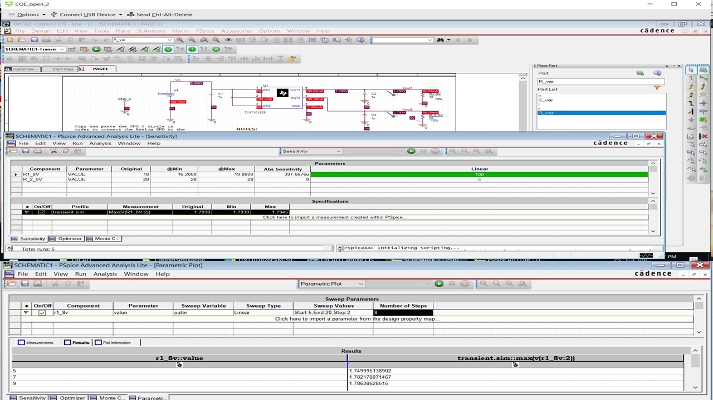
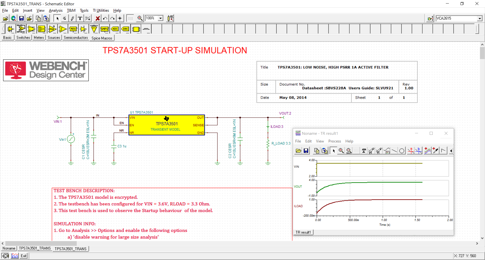
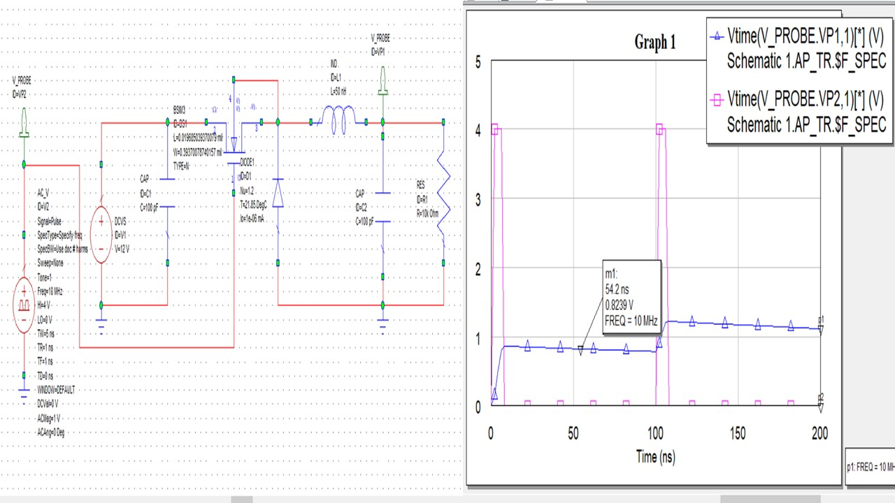

# Power Electronics 

The project provides details on power electroncis for a board design project. 

All images are custom or have references.

## Power Management Integrated Circuits

## Power Tree Diagram 

## Switcher

## Compensation simulation
### Tina-TI 

## Power Electronics 

## Ethics and Integrity

Further knowledge : https://github.com/alpaddesai/DesignEngineering
