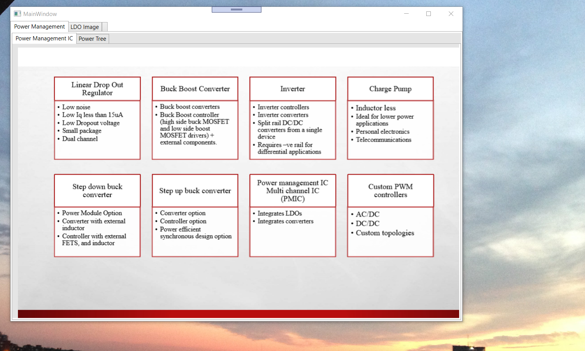
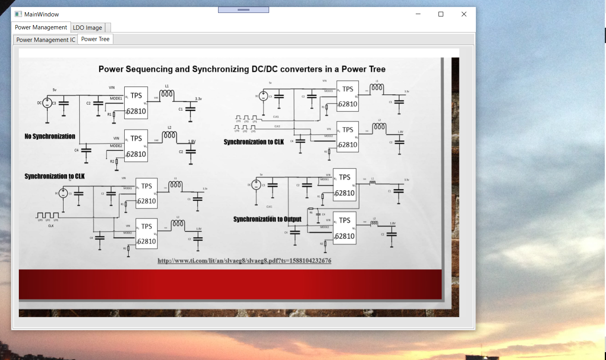
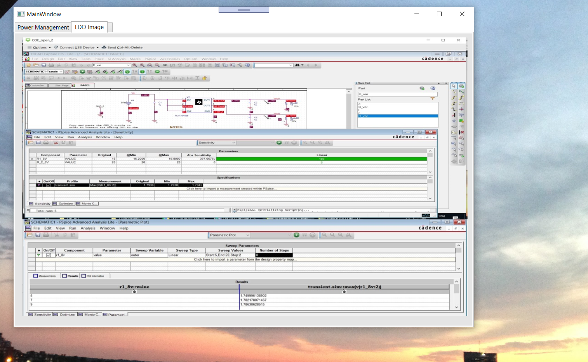
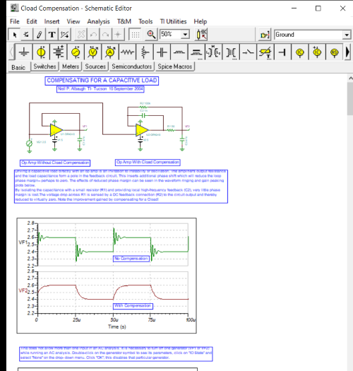
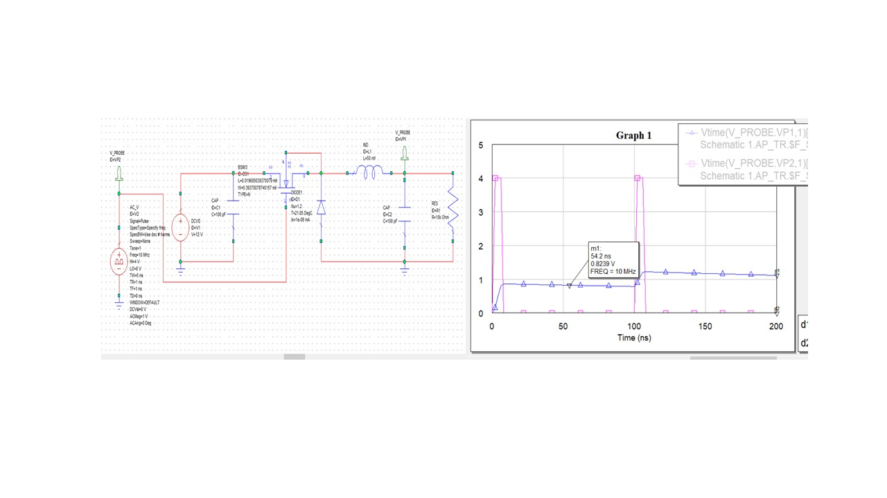
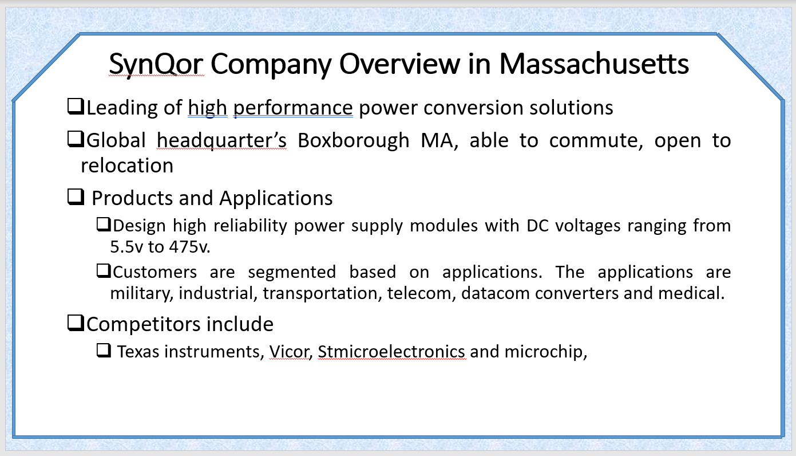

# Power Electronics

The project provides details on power electroncis for a board design project. 

Please click on the executable located in https://github.com/alpaddesai/PowerElectronics/releases for details. 

All images are custom or have references.

## Power Management Integrated Circuits

## Power Tree Diagram 

## Simulation

## Compensation simulation
### Tina-TI 

## Power Electronics Certificate

## Interest

Further knowledge : https://github.com/alpaddesai/PowerDistributionNetworks 
